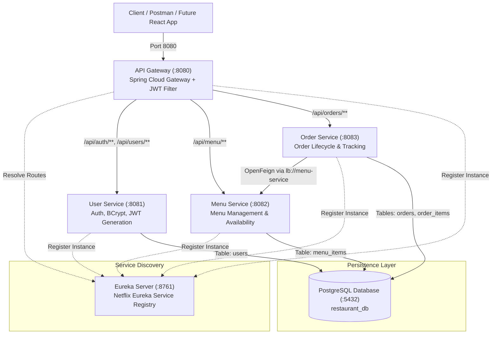
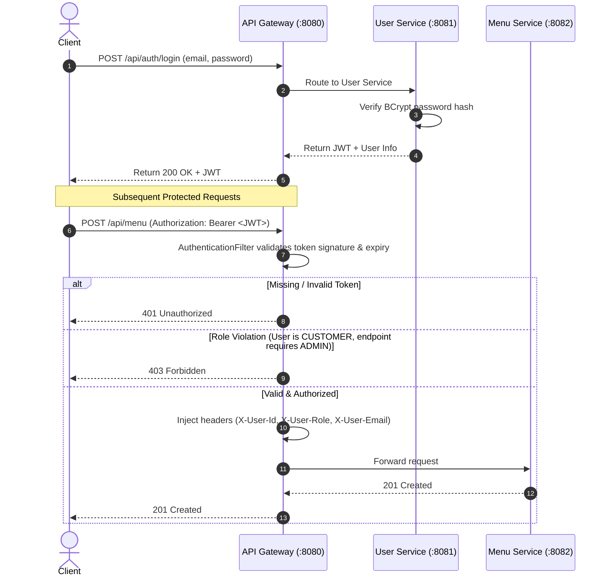

# Multi-Channel Restaurant Management & Kitchen Execution System

> **Academic Project — SOA Review 1 Evaluation**  
> **Architecture Style**: Service-Oriented Architecture (SOA) / Spring Boot Microservices  
> **Evaluation Rubrics**: Problem Analysis, Microservice Identification & Eureka Discovery, JWT Authentication & RBAC, API Gateway Configuration  

---

## Table of Contents
1. [Project Title & Executive Summary](#1-project-title--executive-summary)
2. [Problem Statement](#2-problem-statement)
3. [Proposed Solution](#3-proposed-solution)
4. [Objectives](#4-objectives)
5. [Functional Requirements](#5-functional-requirements)
6. [Non-Functional Requirements](#6-non-functional-requirements)
7. [System Architecture & Diagrams](#7-system-architecture--diagrams)
8. [Microservices Breakdown](#8-microservices-breakdown)
9. [Technology Stack](#9-technology-stack)
10. [Database Design & Schemas](#10-database-design--schemas)
11. [Eureka Service Discovery](#11-eureka-service-discovery)
12. [JWT Authentication & Security Flow](#12-jwt-authentication--security-flow)
13. [API Gateway Routing & Filter Architecture](#13-api-gateway-routing--filter-architecture)
14. [Role-Based Access Control (RBAC) Permissions Matrix](#14-role-based-access-control-rbac-permissions-matrix)
15. [Complete REST API Catalog](#15-complete-rest-api-catalog)
16. [How to Configure PostgreSQL](#16-how-to-configure-postgresql)
17. [Importing into Spring Tool Suite (STS)](#17-importing-into-spring-tool-suite-sts)
18. [Startup Order & Execution Guide](#18-startup-order--execution-guide)
19. [Postman Testing & Automated Verification](#19-postman-testing--automated-verification)
20. [Sample API Requests & Expected Responses](#20-sample-api-requests--expected-responses)
21. [Future React Frontend Integration](#21-future-react-frontend-integration)
22. [Academic Review 1 Evaluation Rubric Mapping](#22-academic-review-1-evaluation-rubric-mapping)
23. [Review 1 Live Demonstration Checklist](#23-review-1-live-demonstration-checklist)

---

## 1. Project Title & Executive Summary

**Project Title**: Multi-Channel Restaurant Management & Kitchen Execution System

Modern food service venues face significant operational hurdles when dealing with multiple ordering channels (counter sales, online ordering, table self-service, kitchen execution). Traditional monolithic restaurant software creates single points of failure, couples menu catalog changes directly to billing systems, and prevents independent scaling of kitchen operations.

This project delivers an enterprise-grade, **loosely coupled Service-Oriented Backend** built on **Spring Boot 3**, **Spring Cloud (Eureka & Gateway)**, and **PostgreSQL**. The platform separates domain responsibilities into independent microservices, enforces role-based security via **JSON Web Tokens (JWT)** at the gateway boundary, and orchestrates live kitchen execution workflows with automated item availability verification.

---

## 2. Problem Statement

Legacy food service management systems suffer from several architectural bottlenecks:
1. **Tight Coupling**: Menu item modifications, user accounts, and billing exist in a shared monolithic database, causing order failures during menu updates.
2. **Hard-Coded Inter-Service Endpoints**: Distributed subsystems frequently hard-code IP addresses and ports, breaking whenever services scale or relocate.
3. **Inconsistent Security & Authorization**: Authentication logic is either duplicated across each module or bypassed internally, risking unauthorized privilege escalation (e.g., customers modifying order statuses or kitchen workflows).
4. **Kitchen Bottlenecks**: Orders are accepted even when specific kitchen ingredients or menu items are depleted, leading to customer dissatisfaction and kitchen delays.

---

## 3. Proposed Solution

A modern **Microservices Architecture** adhering strictly to SOA principles:
1. **Decomposed Business Boundaries**: Three core microservices (`user-service`, `menu-service`, `order-service`) each maintain autonomous persistence and discrete domain logic.
2. **Dynamic Service Discovery**: A centralized **Netflix Eureka Server** (`eureka-server`) automatically tracks live service instances, eliminating hard-coded network addresses.
3. **Edge API Gateway**: A single **Spring Cloud Gateway** (`api-gateway` on port `8080`) serves as the reverse proxy, handling URL routing, load balancing, and security.
4. **Stateless JWT Security**: The API Gateway intercepts requests, verifies digital cryptographic signatures on Bearer tokens, validates claims, checks user roles (`CUSTOMER`, `ADMIN`, `STAFF`), and decorates downstream requests with contextual headers (`X-User-Id`, `X-User-Role`, `X-User-Email`).
5. **Real-Time Availability Verification**: `order-service` communicates with `menu-service` over declarative Feign clients via Eureka discovery to dynamically verify menu item availability and calculate authoritative pricing before confirming any order.

---

## 4. Objectives

- **SOA Review 1 Milestone**: Implement and validate the complete distributed backend infrastructure.
- **Service Independence**: Ensure each service is independently buildable, deployable, and runnable from Spring Tool Suite (STS) or Maven.
- **Robust Security**: Enforce BCrypt password hashing, signed HMAC-SHA256 JWT tokens, and strict role segregation.
- **Resilient Inter-Service Communication**: Demonstrate dynamic discovery-backed communication between Order and Menu services without database coupling.
- **Zero-Friction Evaluation**: Provide pre-seeded test data, an automated Postman collection, and a step-by-step evaluation guide.

---

## 5. Functional Requirements

1. **User Identity & Access Management**:
   - Register users with distinct roles: `CUSTOMER`, `ADMIN`, `STAFF`.
   - Validate credentials and issue signed JWTs containing `userId`, `role`, `email`, and expiration.
   - Secure passwords using BCrypt one-way hashing.
2. **Menu & Inventory Control**:
   - Manage menu items (name, description, price, availability status).
   - Filter items: Customers view available items; Staff/Admin view all items.
   - Admin APIs to create, edit, delete, and toggle item availability (`AVAILABLE` vs. `UNAVAILABLE`).
3. **Order Lifecycle & Kitchen Execution**:
   - Place multi-item customer orders with real-time availability checking.
   - Reject orders immediately if any item is marked `UNAVAILABLE`.
   - Track order status through sequential lifecycle stages: `PLACED` -> `CONFIRMED` -> `PREPARING` -> `READY` -> `OUT_FOR_DELIVERY` -> `DELIVERED` -> `CANCELLED`.
   - Ensure customers can only inspect their own orders.
   - Allow kitchen staff to view the complete order queue and transition status.

---

## 6. Non-Functional Requirements

- **Scalability**: Microservices can scale horizontally with Eureka load balancing (`lb://`).
- **Loose Coupling**: Zero shared databases or cross-service database foreign keys; references are maintained via logical IDs.
- **Statelessness**: REST APIs and API Gateway are completely stateless; session state is retained within the cryptographic JWT.
- **High Performance**: Non-blocking reactive Netty gateway for maximum request throughput.
- **Maintainability**: Clean layered architecture (`controller`, `service`, `repository`, `entity`, `dto`, `exception`).

---

## 7. System Architecture & Diagrams

### ASCII Architecture Diagram

```
+-----------------------------------------------------------------------------+
|               CLIENT LAYER (Postman / Future React Frontend)                |
+-----------------------------------------------------------------------------+
                                       |
                                       | HTTP Requests (Port 8080)
                                       v
+-----------------------------------------------------------------------------+
|                 API GATEWAY (Spring Cloud Gateway :8080)                    |
|  - Token Verification (JWT Filter)   - Route Matching (/api/**)            |
|  - Role-Based Access Control (RBAC)  - Request Header Enrichment           |
+-----------------------------------------------------------------------------+
          |                             |                             |
          | lb://user-service           | lb://menu-service           | lb://order-service
          v                             v                             v
+--------------------+        +--------------------+        +--------------------+
|    USER SERVICE    |        |    MENU SERVICE    |        |   ORDER SERVICE    |
|    (Port 8081)     |        |    (Port 8082)     |        |    (Port 8083)     |
| - Authentication   |        | - Catalog CRUD     |        | - Order Processing |
| - BCrypt & JWT Gen |        | - Item Status      |<-------| - Availability Chk |
| - Role Management  |        | - Price Validation | (Feign)| - Status Tracking  |
+--------------------+        +--------------------+        +--------------------+
          |                             |                             |
          +-----------------------------+-----------------------------+
                                        | Heartbeats & Registration
                                        v
                    +---------------------------------------+
                    |      EUREKA DISCOVERY SERVER          |
                    |            (Port 8761)                |
                    +---------------------------------------+
                                        |
+---------------------------------------+-------------------------------------+
|                      DATABASE LAYER (PostgreSQL :5432)                      |
|                                                                             |
|   Database: restaurant_db                                                   |
|   - users (User Service)                                                    |
|   - menu_items (Menu Service)                                               |
|   - orders, order_items (Order Service)                                     |
+-----------------------------------------------------------------------------+
```

### Mermaid Architecture Diagram



---

## 8. Microservices Breakdown

| Service / Module | Port | Primary Responsibilities | Key Dependencies |
|---|---|---|---|
| **`eureka-server`** | `8761` | Central service registry, heartbeat monitoring, instance discovery. | `spring-cloud-starter-netflix-eureka-server` |
| **`api-gateway`** | `8080` | Reverse proxy, dynamic route resolution, JWT token validation, role-based authorization filter. | `spring-cloud-starter-gateway`, `eureka-client`, `jjwt` |
| **`KL1.1`** (User Service) | `8081` | User registration, login, BCrypt password hashing, JWT generation, user retrieval. | `spring-boot-starter-security`, `spring-boot-starter-data-jpa`, `postgresql`, `jjwt` |
| **`KL2.1`** (Menu Service) | `8082` | Menu item management, pricing, real-time availability status toggling. | `spring-boot-starter-data-jpa`, `postgresql`, `validation` |
| **`KL3.1`** (Order Service) | `8083` | Order placement, inter-service verification with Menu Service via OpenFeign, kitchen status tracking. | `spring-cloud-starter-openfeign`, `spring-boot-starter-data-jpa`, `postgresql` |

---

## 9. Technology Stack

- **Programming Language**: Java 21 (LTS)
- **Framework**: Spring Boot 3.3.4
- **Cloud Infrastructure**: Spring Cloud 2023.0.3 (Leyton)
  - Netflix Eureka Server & Client (Service Discovery)
  - Spring Cloud Gateway (Reactive Non-blocking Edge Proxy)
  - Spring Cloud OpenFeign (Declarative REST Client)
- **Security & Authorization**: Spring Security 6, JJWT 0.12.6, BCrypt Password Encoder
- **Persistence Layer**: Spring Data JPA, Hibernate 6, PostgreSQL 18 Driver
- **Data Validation**: Jakarta Bean Validation (`@NotBlank`, `@NotNull`, `@Positive`, `@Email`)
- **Build & Dependency Management**: Apache Maven 3.9+
- **Target IDE**: Spring Tool Suite (STS) / Eclipse

---

## 10. Database Design & Schemas

The microservices share a single PostgreSQL database instance (`restaurant_db`), but **maintain strict schema boundaries** with no foreign keys connecting across services.

### Table: `users` (Managed by `user-service`)
```sql
CREATE TABLE users (
    id BIGSERIAL PRIMARY KEY,
    name VARCHAR(255) NOT NULL,
    email VARCHAR(255) NOT NULL UNIQUE,
    password VARCHAR(255) NOT NULL,
    role VARCHAR(50) NOT NULL,       -- CUSTOMER, ADMIN, STAFF
    created_at TIMESTAMP NOT NULL
);
```

### Table: `menu_items` (Managed by `menu-service`)
```sql
CREATE TABLE menu_items (
    item_id BIGSERIAL PRIMARY KEY,
    name VARCHAR(255) NOT NULL,
    description VARCHAR(500) NOT NULL,
    price NUMERIC(10, 2) NOT NULL,
    availability_status VARCHAR(50) NOT NULL -- AVAILABLE, UNAVAILABLE
);
```

### Table: `orders` (Managed by `order-service`)
```sql
CREATE TABLE orders (
    order_id BIGSERIAL PRIMARY KEY,
    user_id BIGINT NOT NULL,          -- Logical reference to users.id
    total_amount NUMERIC(10, 2) NOT NULL,
    status VARCHAR(50) NOT NULL,      -- PLACED, CONFIRMED, PREPARING, READY, OUT_FOR_DELIVERY, DELIVERED, CANCELLED
    created_at TIMESTAMP NOT NULL
);
```

### Table: `order_items` (Managed by `order-service`)
```sql
CREATE TABLE order_items (
    id BIGSERIAL PRIMARY KEY,
    order_id BIGINT NOT NULL REFERENCES orders(order_id) ON DELETE CASCADE,
    item_id BIGINT NOT NULL,          -- Logical reference to menu_items.item_id
    item_name VARCHAR(255) NOT NULL,
    quantity INTEGER NOT NULL,
    unit_price NUMERIC(10, 2) NOT NULL,
    subtotal NUMERIC(10, 2) NOT NULL
);
```

---

## 11. Eureka Service Discovery

### What Eureka Does
Netflix Eureka provides automated service registry and dynamic lookup:
1. When any microservice starts, its Eureka Client registers its host, port, and health status under its application name (`USER-SERVICE`, `MENU-SERVICE`, `ORDER-SERVICE`, `API-GATEWAY`).
2. Microservices send heartbeat signals every 30 seconds.
3. The API Gateway queries Eureka to dynamically locate instances for `lb://<service-name>` without needing static IP addresses.
4. `order-service` uses `@FeignClient(name = "menu-service")` to resolve the address of `menu-service` directly from the Eureka registry.

### Accessing the Eureka Dashboard
Open your web browser and navigate to:
```
http://localhost:8761
```
The dashboard displays all registered instances, their system status, and memory metrics.

---

## 12. JWT Authentication & Security Flow

### Key Concepts
- **Token Generation**: Occurs exclusively in `user-service` upon successful credential verification.
- **Cryptographic Signing**: HMAC-SHA256 with a 256-bit secret key (`jwt.secret`).
- **Claims Payload**:
  - `sub`: User email address
  - `userId`: Numeric database ID
  - `role`: Role string (`CUSTOMER`, `ADMIN`, `STAFF`)
  - `iat`: Issue timestamp
  - `exp`: Expiration timestamp (24 hours)

### Security Sequence Flow


---

## 13. API Gateway Routing & Filter Architecture

### Dynamic Routes Configured in `application.yml`
```yaml
spring:
  cloud:
    gateway:
      routes:
        - id: auth-route
          uri: lb://user-service
          predicates:
            - Path=/api/auth/**
        - id: user-route
          uri: lb://user-service
          predicates:
            - Path=/api/users/**
        - id: menu-route
          uri: lb://menu-service
          predicates:
            - Path=/api/menu/**
        - id: order-route
          uri: lb://order-service
          predicates:
            - Path=/api/orders/**
```

### Gateway Filter Execution (`AuthenticationFilter.java`)
1. **Public Exemption**: Requests to `/api/auth/**` bypass token checks.
2. **Bearer Token Check**: Checks for `Authorization: Bearer <token>`. Returns `401 Unauthorized` if absent.
3. **Cryptographic Validation**: Parses and verifies signature using `JwtUtil`. Returns `401 Unauthorized` if expired or tampered.
4. **Role Enforcement**:
   - Menu mutations (`POST`, `PUT`, `DELETE`, `PATCH /api/menu/**`) require `ADMIN`. If non-admin, returns `403 Forbidden`.
   - Order status transitions (`PUT /api/orders/{id}/status`) require `STAFF`. If non-staff, returns `403 Forbidden`.
   - All orders view (`GET /api/orders`) requires `STAFF` or `ADMIN`. If customer, returns `403 Forbidden`.
5. **Header Enrichment**: Passes `X-User-Id`, `X-User-Role`, and `X-User-Email` downstream.

---

## 14. Role-Based Access Control (RBAC) Permissions Matrix

| API Endpoint | HTTP Method | CUSTOMER | ADMIN | STAFF | Notes |
|---|:---:|:---:|:---:|:---:|---|
| `/api/auth/register` | `POST` | Allowed | Allowed | Allowed | Public endpoint |
| `/api/auth/login` | `POST` | Allowed | Allowed | Allowed | Public endpoint |
| `/api/users/{id}` | `GET` | Own profile | Allowed | Allowed | User profile query |
| `/api/users` | `GET` | Denied (403) | Allowed | Allowed | Administrative directory |
| `/api/menu` | `GET` | Available only | All items | All items | Catalog viewing |
| `/api/menu/{id}` | `GET` | Allowed | Allowed | Allowed | Item detail |
| `/api/menu` | `POST` | Denied (403) | Allowed | Denied (403) | Add menu item |
| `/api/menu/{id}` | `PUT` | Denied (403) | Allowed | Denied (403) | Update item |
| `/api/menu/{id}` | `DELETE` | Denied (403) | Allowed | Denied (403) | Delete item |
| `/api/menu/{id}/availability` | `PATCH` | Denied (403) | Allowed | Denied (403) | Toggle availability |
| `/api/orders` | `POST` | Allowed | Allowed | Allowed | Place customer order |
| `/api/orders/{id}` | `GET` | Own order only | Allowed | Allowed | View single order |
| `/api/orders/user/{userId}` | `GET` | Own orders only | Allowed | Allowed | View customer history |
| `/api/orders` | `GET` | Denied (403) | Allowed | Allowed | Kitchen order queue |
| `/api/orders/{id}/status` | `PUT` | Denied (403) | Denied (403) | Allowed | Update kitchen status |

---

## 15. Complete REST API Catalog

All endpoints are accessed through the API Gateway at `http://localhost:8080`.

### Authentication APIs (`user-service`)
- `POST /api/auth/register`: Create a new user account.
- `POST /api/auth/login`: Authenticate and receive a signed Bearer JWT.
- `GET /api/users/{id}`: Fetch user by numeric ID.
- `GET /api/users`: List all registered users.

### Menu APIs (`menu-service`)
- `GET /api/menu`: List menu items (filtered by availability for customers).
- `GET /api/menu/{id}`: Retrieve a specific item by ID.
- `POST /api/menu`: Create a new menu item (**ADMIN**).
- `PUT /api/menu/{id}`: Update an existing menu item (**ADMIN**).
- `DELETE /api/menu/{id}`: Delete a menu item (**ADMIN**).
- `PATCH /api/menu/{id}/availability`: Update availability status (**ADMIN**).

### Order APIs (`order-service`)
- `POST /api/orders`: Place a new order with real-time menu validation (**CUSTOMER**).
- `GET /api/orders/{id}`: Fetch order details by order ID.
- `GET /api/orders/user/{userId}`: Retrieve all orders placed by a specific user.
- `GET /api/orders`: Retrieve all orders across the system (**STAFF / ADMIN**).
- `PUT /api/orders/{id}/status`: Advance an order through kitchen workflow stages (**STAFF**).

---

## 16. How to Configure PostgreSQL

### Prerequisites
- PostgreSQL 14+ (installed on `localhost:5432`).
- Default credentials configured in the services:
  - **Username**: `postgres`
  - **Password**: `root`
  - **Port**: `5432`

### Database Setup
Open PowerShell or pgAdmin and execute:
```sql
CREATE DATABASE restaurant_db;
```

Hibernate is configured with `spring.jpa.hibernate.ddl-auto=update`, which automatically generates the schema (`users`, `menu_items`, `orders`, `order_items`) upon startup of each respective microservice.

---

## 17. Importing into Spring Tool Suite (STS)

1. Open **Spring Tool Suite (STS)**.
2. Select **File -> Import... -> Existing Maven Projects**.
3. Click **Browse...** and select the root directory:
   ```
   C:\Users\Vempa\OneDrive\Desktop\SOA PROJECT 3.1(02)
   ```
4. STS will detect the root `pom.xml` and all 5 sub-modules:
   - `restaurant-management-system` (parent)
   - `eureka-server`
   - `api-gateway`
   - `user-service`
   - `menu-service`
   - `order-service`
5. Ensure all 5 checkboxes are checked, then click **Finish**.
6. Wait for Maven to download dependencies and build the workspace.

---

## 18. Startup Order & Execution Guide

> [!IMPORTANT]
> The microservices must be started in the exact order shown below to ensure that service discovery is available when downstream services register.

### Recommended Startup Order
```
Step 1: eureka-server (:8761)
          │  (Wait ~10 seconds for registry initialization)
          ▼
Step 2: KL1.1         (:8081 - User Service)
          │
          ▼
Step 3: KL2.1         (:8082 - Menu Service)
          │
          ▼
Step 4: KL3.1         (:8083 - Order Service)
          │
          ▼
Step 5: api-gateway   (:8080)
```

### Running from Spring Tool Suite (STS)
1. In the **Boot Dashboard** or **Package Explorer**, locate each main application class:
   - `eureka-server` -> `EurekaServerApplication.java` -> **Run As -> Spring Boot App**
   - `KL1.1` -> `KL11Application.java` -> **Run As -> Spring Boot App**
   - `KL2.1` -> `KL21Application.java` -> **Run As -> Spring Boot App**
   - `KL3.1` -> `KL31Application.java` -> **Run As -> Spring Boot App**
   - `api-gateway` -> `ApiGatewayApplication.java` -> **Run As -> Spring Boot App**

### Running from Command Line (PowerShell)
Open 5 separate terminal tabs in the project root directory:

```powershell
# Terminal 1 - Eureka Server (Port 8761)
.\mvnw.bat -pl eureka-server spring-boot:run

# Terminal 2 - KL1.1 User Service (Port 8081)
.\mvnw.bat -pl KL1.1 spring-boot:run

# Terminal 3 - KL2.1 Menu Service (Port 8082)
.\mvnw.bat -pl KL2.1 spring-boot:run

# Terminal 4 - KL3.1 Order Service (Port 8083)
.\mvnw.bat -pl KL3.1 spring-boot:run

# Terminal 5 - API Gateway (Port 8080)
.\mvnw.bat -pl api-gateway spring-boot:run
```

### Alternatively: Running Pre-Built JAR Files Directly
```powershell
java -jar eureka-server\target\eureka-server-1.0.0.jar
java -jar KL1.1\target\KL1.1-1.0.0.jar
java -jar KL2.1\target\KL2.1-1.0.0.jar
java -jar KL3.1\target\KL3.1-1.0.0.jar
java -jar api-gateway\target\api-gateway-1.0.0.jar
```

---

## 19. Postman Testing & Automated Verification

### Importing the Collection
1. Open **Postman**.
2. Click **Import** (top left).
3. Select the file located at:
   `postman/Restaurant_SOA_Review1.postman_collection.json`
4. The imported collection contains all test scenarios, with automated scripts that store JWT tokens in collection variables.

### Pre-Seeded Test Credentials
The applications automatically seed development credentials on startup:
| Role | Email | Password |
|---|---|---|
| **CUSTOMER** | `customer@example.com` | `Customer@123` |
| **ADMIN** | `admin@example.com` | `Admin@123` |
| **STAFF** | `staff@example.com` | `Staff@123` |

---

## 20. Sample API Requests & Expected Responses

### 1. User Login (Obtain JWT)
- **POST** `http://localhost:8080/api/auth/login`
- **Request Body**:
  ```json
  {
    "email": "customer@example.com",
    "password": "Customer@123"
  }
  ```
- **Response (200 OK)**:
  ```json
  {
    "token": "eyJhbGciOiJIUzI1NiJ9.eyJzdWIiOiJjdXN0b21lckBleGFtcGxlLmNvbSIsInVzZXJJZCI6MSwibmFtZSI6IkpvaG4gQ3VzdG9tZXIiLCJyb2xlIjoiQ1VTVE9NRVIiLCJpYXQiOjE2OTU...}",
    "userId": 1,
    "name": "John Customer",
    "email": "customer@example.com",
    "role": "CUSTOMER"
  }
  ```

### 2. View Menu (Customer)
- **GET** `http://localhost:8080/api/menu`
- **Headers**: `Authorization: Bearer <customer_token>`
- **Response (200 OK)**:
  ```json
  [
    {
      "itemId": 1,
      "name": "Chicken Biryani",
      "description": "Aromatic basmati rice cooked with spiced chicken and authentic Indian spices",
      "price": 12.99,
      "availabilityStatus": "AVAILABLE"
    },
    {
      "itemId": 5,
      "name": "Masala Dosa",
      "description": "Crispy fermented crepe stuffed with spiced potato filling",
      "price": 6.99,
      "availabilityStatus": "AVAILABLE"
    }
  ]
  ```

### 3. Place Order (Order Placement Flow with Availability Check)
- **POST** `http://localhost:8080/api/orders`
- **Headers**: `Authorization: Bearer <customer_token>`
- **Request Body**:
  ```json
  {
    "userId": 1,
    "items": [
      { "itemId": 1, "quantity": 2 },
      { "itemId": 5, "quantity": 1 }
    ]
  }
  ```
- **Response (201 Created)**:
  ```json
  {
    "orderId": 1,
    "userId": 1,
    "totalAmount": 32.97,
    "status": "PLACED",
    "createdAt": "2026-09-18T22:45:00",
    "items": [
      {
        "id": 1,
        "itemId": 1,
        "itemName": "Chicken Biryani",
        "quantity": 2,
        "unitPrice": 12.99,
        "subtotal": 25.98
      },
      {
        "id": 2,
        "itemId": 5,
        "itemName": "Masala Dosa",
        "quantity": 1,
        "unitPrice": 6.99,
        "subtotal": 6.99
      }
    ]
  }
  ```

### 4. Order Rejection (Item Unavailable)
- **POST** `http://localhost:8080/api/orders`
- **Headers**: `Authorization: Bearer <customer_token>`
- **Request Body** (Item 8 is Burger, pre-seeded as UNAVAILABLE):
  ```json
  {
    "userId": 1,
    "items": [
      { "itemId": 8, "quantity": 1 }
    ]
  }
  ```
- **Response (400 Bad Request)**:
  ```json
  {
    "timestamp": "2026-09-18T22:46:12.312",
    "status": 400,
    "error": "Bad Request",
    "message": "Selected menu item 'Burger' is currently unavailable.",
    "path": "/api/orders"
  }
  ```

### 5. Role-Based Forbidden Response (Customer Attempts Admin API)
- **POST** `http://localhost:8080/api/menu`
- **Headers**: `Authorization: Bearer <customer_token>`
- **Response (403 Forbidden)**:
  ```json
  {
    "timestamp": "2026-09-18T22:47:00.124",
    "status": 403,
    "error": "Forbidden",
    "message": "Access denied: Admin role required for menu management",
    "path": "/api/menu"
  }
  ```

### 6. Kitchen Status Update (Staff Workflow)
- **PUT** `http://localhost:8080/api/orders/1/status`
- **Headers**: `Authorization: Bearer <staff_token>`
- **Request Body**:
  ```json
  {
    "status": "PREPARING"
  }
  ```
- **Response (200 OK)**:
  ```json
  {
    "orderId": 1,
    "userId": 1,
    "totalAmount": 32.97,
    "status": "PREPARING",
    "createdAt": "2026-09-18T22:45:00",
    "items": [...]
  }
  ```

---

## 21. Future React Frontend Integration

As outlined in [frontend/README.md](frontend/README.md), the client application will be built using React.js and JavaScript in subsequent iterations.
- Single communication endpoint: `http://localhost:8080` (API Gateway).
- No frontend client will ever communicate directly with internal microservice ports (`8081`, `8082`, `8083`).
- JWT token stored in client storage and attached automatically via Axios interceptors.
- Role-based routing for Customer, Kitchen Staff, and Administrator views.

---

## 22. Academic Review 1 Evaluation Rubric Mapping

| Evaluation Rubric | Implementation Evidence | Source Location |
|---|---|---|
| **Rubric 1: Problem Analysis and Requirements** | Clear domain breakdown addressing monolithic bottlenecks; separation into User, Menu, and Order domains with explicit functional & non-functional requirements. | `README.md` Sections 2-6 |
| **Rubric 2: Microservice Identification & Service Discovery** | Independent Spring Boot services registered with Netflix Eureka Server (`:8761`). Inter-service communication from Order Service to Menu Service using `@FeignClient(name = "menu-service")` without hard-coded hostnames. | `eureka-server/`, `KL3.1/src/main/java/com/klu/springmvc/client/MenuServiceClient.java` |
| **Rubric 3: JWT Authentication & Role-Based Authorization** | Stateless authentication using HMAC-SHA256 JWT tokens with BCrypt password hashing. Role segregation (`CUSTOMER`, `ADMIN`, `STAFF`) enforced both at Gateway and microservice levels. | `KL1.1/src/main/java/com/klu/springmvc/security/`, `api-gateway/src/main/java/com/restaurant/gateway/filter/` |
| **Rubric 4: API Gateway Configuration** | Centralized Spring Cloud Gateway on port `8080` routing traffic to `lb://user-service`, `lb://menu-service`, and `lb://order-service`. Custom global authentication filter enforcing RBAC and rejecting invalid requests. | `api-gateway/src/main/resources/application.yml`, `api-gateway/src/main/java/com/restaurant/gateway/filter/AuthenticationFilter.java` |

---

## 23. Review 1 Live Demonstration Checklist

Use this checklist during your faculty review presentation:

- [ ] **1. Show Eureka Dashboard**: Open `http://localhost:8761` and verify that `API-GATEWAY`, `USER-SERVICE`, `MENU-SERVICE`, and `ORDER-SERVICE` are all registered and UP.
- [ ] **2. Show API Gateway Routing**: Send a request to `http://localhost:8080/api/menu` and explain how the Gateway resolves the request through Eureka.
- [ ] **3. Demonstrate Customer Login & JWT Generation**: Execute login for `customer@example.com` and inspect the generated token claims.
- [ ] **4. Demonstrate Role-Based Protection (403 Forbidden)**: Attempt to add a menu item using the customer JWT to prove admin enforcement.
- [ ] **5. Demonstrate Admin Menu Creation & Availability Toggle**: Use the admin JWT to add an item and toggle its status between `AVAILABLE` and `UNAVAILABLE`.
- [ ] **6. Demonstrate Order Placement & Availability Check**:
  - Place an order with available items (Biryani + Dosa) -> observe **201 Created**.
  - Attempt an order with Burger (`UNAVAILABLE`) -> observe **400 Bad Request** with clear error message.
- [ ] **7. Demonstrate Staff Kitchen Execution Workflow**:
  - Show the kitchen order queue via `GET /api/orders` with staff JWT.
  - Advance status from `PLACED` -> `PREPARING` -> `READY` via `PUT /api/orders/1/status`.
- [ ] **8. Demonstrate Security Edge Cases (401 Unauthorized)**:
  - Send a request without the `Authorization` header.
  - Send a request with a tampered/fake token.
